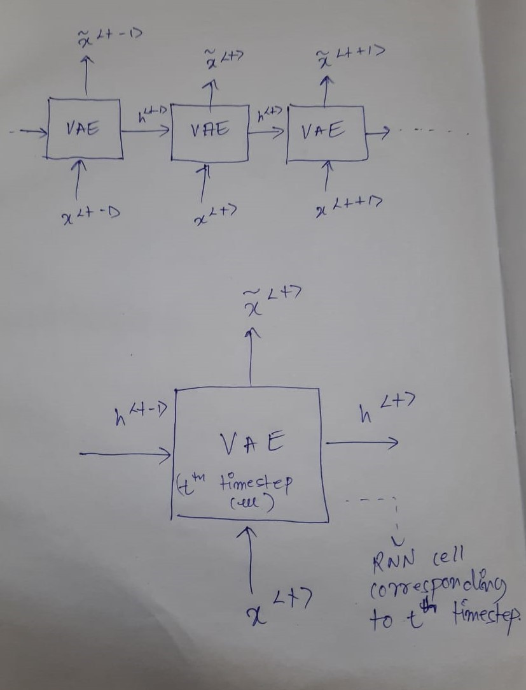
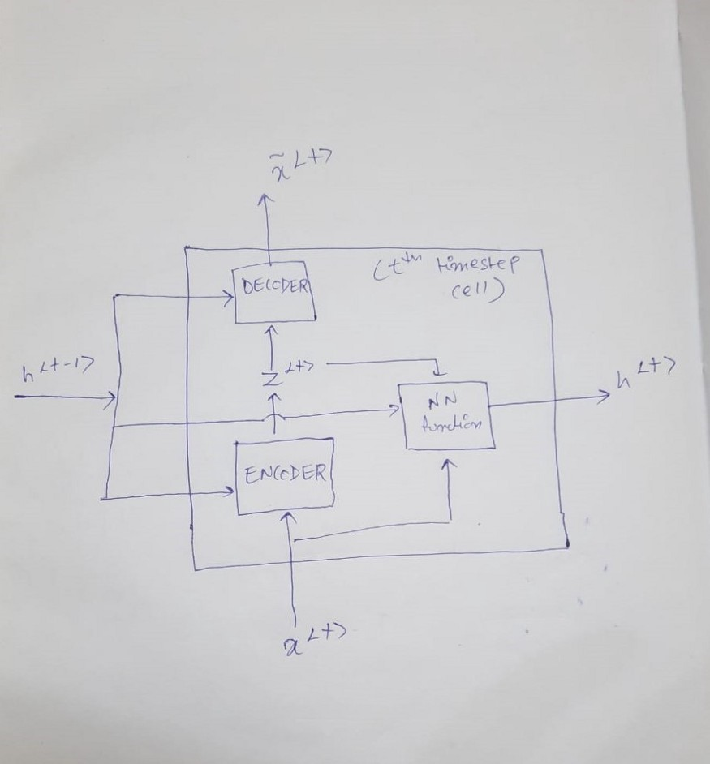

# Variational_Recurrent_Neural_Networks

Implemented this novel architecture (in pytorch) as part of my research study for the problem I focused on, 
during my work as a <b>Research Intern</b> at <b>Language Technology Research Center, IIIT Hyderabad, India.</b><br>


<b>Wrote a blog on medium:</b> <a href="https://medium.com/@deep_space/variational-recurrent-neural-networks-vrnns-3b836adad399">Variational Recurrent Neural Networks - VRNNs</a>
<hr>

Variational Recurrent Neural Networks are a class of latent variable models for sequential data. The major idea behind this work is the inclusion of latent random variables at every time step of the RNN, or more specifically, it contains variational autoencoder at each and every time step of the RNN.

<h3>High level structure of VRNN:</h3>


<h3>Detailed view of a cell at timestep t of VRNN:</h3>



This is the result of the work by Junyoung et al. - <a href="https://arxiv.org/pdf/1506.02216.pdf">A Latent Variable Model For Sequential Data</a>

<b>From the original research paper:</b><br>
<i>"In this paper, we explore the inclusion of latent random variables into the hidden state of a recurrent neural network (RNN) by combining the elements of the
variational autoencoder. We argue that through the use of high-level latent random variables, the variational RNN (VRNN)1
can model the kind of variability
observed in highly structured sequential data such as natural speech. We empirically evaluate the proposed model against other related sequential models on four
speech datasets and one handwriting dataset. Our results show the important roles
that latent random variables can play in the RNN dynamics."</i>

<hr>

### Running codes:

For training: <br>
Navigate to the src folder and run the command: ```python train.py```<br>

For sampling:<br>
Navigate to the src folder and:
1. For sampling from the **prior** distribution: ```python sample_from_prior.py``` 
2. For sampling from **posterior** distribution: ```python sample_from_posterior.py```<br>
(uncomment the get_data() line in main function (in sample_from_posterior.py) for which you want to get posterior samples)
<br>
